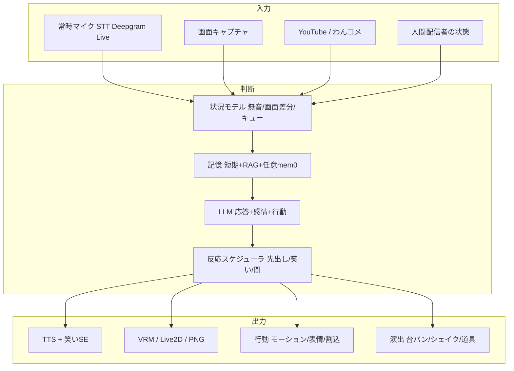
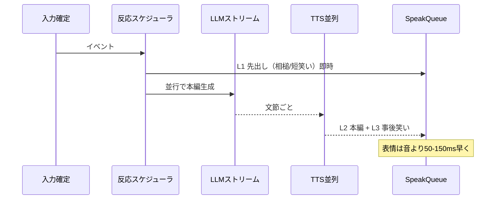

# AITuberKit 開発作業計画書（共演配信・Neuro 様方向）

> **目的**: 人間配信者と AI キャラクターを一緒に配信し、Neuro-sama のように「常に聞いていて・画面を見て・記憶して・感情豊かに動き・状況に応じて話しかける」体験へ段階的に近づける。  
> **参照**: 比較対象 [pngtuber-main](../pngtuber-main)（別リポジトリ）、本リポジトリ既存機能（`src/features/`）。

**最終更新**: 2026-05-23  
**ステータス**: 計画（未実装フェーズの合意用ドキュメント）  
**関連**: §4.5 会話リアリティ / §Phase 6 身体性演出（台パン等）

---

## 1. ビジョン

| 軸 | 目標像 |
|----|--------|
| **共演** | 人間のマイク・画面・コメントと AI が同じ「配信セッション」を共有する |
| **聴覚** | STT は人間と同様、**常時マイク ON**（Deepgram Live 等）を第一候補とする |
| **視覚** | **画面キャプチャ実況**（ゲーム・作業画面へのリアクション） |
| **記憶** | 視聴者単位・日次ログ・長期ファクト（mem0 相当）は **必要性が出たら** 追加 |
| **表現** | 感情タグ + モーション + 将来的には「行動レイヤ」（独り言・割込み・ツッコミ） |
| **能動性** | 配信状態（無音・コメント枯れ・画面変化）を把握し、**適宜話しかける** |
| **会話リアリティ** | **笑い声**・**相槌**・**反応の速さ**（人間配信に近いテンポ） |
| **身体性・演出** | **台パン**・机の振動・道具触り — **中に人がいる**ような没入感（Phase 6） |

Neuro-sama 的な体験は「単一の巨大機能」ではなく、**入力（聴く・見る）× 記憶 × 出力（話す・動く）× タイミング（いつ・どう話すか）× 非言語（笑う・間）× 身体（叩く・のけぞる・驚いて後退）** の積み上げで実現する。

---

## 2. アイドルモードとは（現行 AITuberKit）

**アイドルモード**は、配信・対話が **しばらく途切えたとき** に、AI キャラクターが **自発的にしゃべる** 機能である。Neuro の「独り言・フィラー」に近いが、現状は **定型・時間帯・AI 生成** の3ソースに限定されている。

### 動作概要

- **トリガー**: 最後の会話から `idleInterval` 秒（10〜300秒、既定 30秒）経過、かつ他処理（チャット応答・人感挨拶等）がアイドル
- **発話ソース**（設定で ON/OFF）:
  1. **定型フレーズ** — 登録した文を順番 / ランダム再生
  2. **時間帯別挨拶** — 朝・昼・夕で別メッセージ（例: おはよう）
  3. **AI 自動生成** — プロンプトテンプレートから LLM が短い一言を生成
- **実装**: `useIdleMode` + `IdleManager`、感情付きで `speakCharacter` 経由再生
- **設定場所**: 設定 → **アイドル** タブ（`idleSettings.tsx`）

### Neuro 方向との関係

| 現行アイドル | 将来の「能動発話」 |
|-------------|-------------------|
| 無会話タイマーのみ | 画面変化・コメント枯れ・共演者の発話終了もトリガーに |
| 短い一言中心 | ツッコミ・実況・割込み・話題転換 |
| 他モードと排他気味 | STT 常時 ON・画面実況と **優先度キュー** で統合 |

→ 本計画の **Phase 4（状況把握・能動発話）** でアイドルを拡張・統合する想定。

---

## 3. 現状資産（すでに使えるもの）

### AITuberKit 側

| 領域 | 既存機能 | 共演での活用 |
|------|----------|--------------|
| 配信コメント | YouTube API / **わんコメ**（Twitch 等を集約可） | 視聴者入力 |
| 会話継続 | Mastra ワークフロー（継続・新トピック・スリープ） | コメントが少ないときの自発話 **の前身** |
| STT | ブラウザ Web Speech / Whisper / Realtime API | 常時 ON は未対応、要 Deepgram 等 |
| 記憶 | `maxPastMessages` + RAG（IndexedDB + Embedding） | セッション跨ぎ・視聴者 ID は弱い |
| 感情・モーション | `[happy]` `[motion:xxx]`、Live2D/VRM マッピング | 拡張の土台 |
| 視覚 | マルチモーダル（カメラ・画像アップロード） | **画面キャプチャ実況は未実装** |
| 能動性 | **アイドルモード**、**人感検知**（キオスク向け） | 配信向け状況モデルは未整備 |
| 外部連携 | WebSocket 外部連携モード | Python サイドカー連携の候補 |
| 会話リアリティ | LLM ストリーム → 文節 TTS → `SpeakQueue` 直列再生 | **笑い専用音・先出し反応・低遅延パイプラインは未整備**（§4.5） |
| 身体性演出 | VRM `[motion:]`・Live2D モーション・画像オーバーレイ | **台パン SE・画面シェイク・複合演出キューは未整備**（Phase 6） |

### pngtuber-main から持ってこれる知見（コード参照用）

| 機能 | 参照先 |
|------|--------|
| Deepgram STT（Live 方針） | `pngtuber-main/docs/stt-deepgram.md`, `src/input/providers/deepgram.py` |
| 画面実況 | `src/vision/commentator.py`, `src/vision/capture.py` |
| mem0 長期記憶 | `src/memory/long_term.py` |
| 日次 jsonl | `memory/characters/*/logs/*.jsonl` |
| VTS 感情・口パク | `src/avatar/vtube_studio.py`（Live2D は VTS 経由の参考） |

---

## 4. 目標アーキテクチャ（概念）



**設計原則**

1. **単一の発話キュー**（`SpeakQueue` 拡張）— 人間の発話中は AI が被らない優先度制御
2. **状況はストア1箇所** — `homeStore` または新 `sessionStore` に集約
3. **ブラウザ完結を優先** — mem0/Qdrant はサーバー負荷・運用が重いため Phase 3 で要否判断

---

## 5. フェーズ別作業計画

### Phase 0 — 配信基盤の安定化（前提）

**ゴール**: 共演の土台として、ローカル開発・配信モードが安定して動く。

| # | タスク | 詳細 | 優先度 |
|---|--------|------|--------|
| 0-1 | Node 24 環境の標準化 | `.nvmrc` 準拠、`docs` に Mac 手順（`SHARP_IGNORE_GLOBAL_LIBVIPS` 等） | P0 |
| 0-2 | `.env` テンプレ整備 | 共演用: YouTube / わんコメ / OpenAI / Deepgram キー欄 | P0 |
| 0-3 | 配信モード動作確認 | YouTube モード + わんコメ接続の E2E チェックリスト | P1 |
| 0-4 | 共演向けプリセット | システムプロンプト例（人間への譲り・割込み禁止ルール） | P2 |

**完了条件**: `npm run dev` で VRM 表示 + YouTube コメント1件応答が再現できる。

---

### Phase 1 — STT 常時 ON（Deepgram）

**ゴール**: 人間配信者と同様、マイクを常に聞き、発話終了を自動検知してテキスト化する。

| # | タスク | 詳細 | 優先度 |
|---|--------|------|--------|
| 1-1 | Deepgram プロバイダ追加 | `speechRecognitionMode: 'deepgram'`、設定 UI・`.env.example` | P0 |
| 1-2 | **Live WebSocket** 実装 | pngtuber の Prerecorded 一括送信ではなく **Streaming API** + endpointing（`docs/stt-deepgram.md` 参照） | P0 |
| 1-3 | 常時リスニング UI | 設定: `continuousMicListeningMode` との統合・排他ルール更新（`exclusionRules.ts`） | P0 |
| 1-4 | 発話キュー連携 | 確定テキスト → 既存 `handleSendChat` または「人間用」「AI用」チャンネル分離 | P1 |
| 1-5 | 共演モード | 人間 STT 結果は **LLM に渡さない** / 要約のみ渡す 等、トグルで選択 | P1 |

**技術メモ**

- API ルート: `/api/stt/deepgram`（トークン発行 or プロキシ）— API キーをブラウザに直置きしない
- Realtime API モード・Whisper モードとの排他を UI で明示

**完了条件**: マイク ON のまま話すと、無音後 〜1秒でテキストがチャット欄 or 内部ログに入る。

---

### Phase 2 — 画面キャプチャ実況

**ゴール**: 配信中の画面を定期的 or イベント駆動でキャプチャし、キャラが実況コメントする。

| # | タスク | 詳細 | 優先度 |
|---|--------|------|--------|
| 2-1 | キャプチャ方式選定 | **案A**: ブラウザ `getDisplayMedia`（タブ/画面共有） / **案B**: Electron デスクトップキャプチャ | P0 |
| 2-2 | Vision API 連携 | マルチモーダル対応 LLM（Gemini / OpenAI 等）へ画像 + プロンプト | P0 |
| 2-3 | 実況ループ | 間隔・差分検知（前フレームとの変化率）で API コール抑制 | P1 |
| 2-4 | 感情・発話連携 | Vision 結果 JSON `{ text, emotion }` → `[emotion]` + TTS | P1 |
| 2-5 | 設定 UI | 設定タブ追加: 有効/無効、間隔、解像度、プライバシー注意 | P2 |

**pngtuber からの移植要点**

- `ScreenCapture` + `ScreenCommentator` のプロンプト設計（`soul.md` 相当 → 本プロジェクトは `systemPrompt`）
- 配信では **ゲーム画面のみ** 共有する運用ルールをドキュメント化

**完了条件**: 画面共有 ON で、30秒ごと（または変化検知）にキャラが1文実況する。

---

### Phase 3 — 記憶の強化（要否判断付き）

**ゴール**: 視聴者を覚え、日次で振り返れる。ただし **現行 RAG で足りるなら実装しない**。

#### 3-A. 現行機能で足りるケース

- 1配信セッション内の文脈のみ重要 → `maxPastMessages` + `memoryEnabled`（RAG）で十分
- 視聴者名は YouTube コメントの `userName` が既にプロンプトに入る

#### 3-B. mem0 / jsonl を入れるべきケース

- **同じ視聴者が複数回配信に来る**ことをキャラが言及する
- 「前回の配信で〜」と **日を跨いだ参照** が必要
- モデレーション・振り返り用に **ログをファイルで残したい**

| # | タスク | 詳細 | 優先度 |
|---|--------|------|--------|
| 3-1 | 記憶要件の評価 | Phase 1〜2 運用後に 3-A / 3-B を判定（判定記録を本 doc に追記） | P0 |
| 3-2 | 日次 jsonl ログ（軽量） | `chatLog` スナップショットを API で JSONL 追記（サーバー or ローカル DL） | P2 |
| 3-3 | 視聴者 ID キー | YouTube チャンネル ID / わんコメ ID を `userName` から安定化 | P2 |
| 3-4 | mem0 + Qdrant（重量） | 別サービス or Next API 背後に Python ワーカー—運用コスト大 | P3 |

**推奨**: まず **3-2 jsonl のみ**（pngtuber より軽い）。mem0 は「RAG + 視聴者メモ」で代替できないときだけ。

---

### Phase 4 — 感情・行動の豊富化 + 状況把握・能動発話

**ゴール**: Neuro 様に近い「豊かな表情・動き」と「状況に応じた話しかけ」。

| # | タスク | 詳細 | 優先度 |
|---|--------|------|--------|
| 4-1 | 感情スキーマ拡張 | 6感情 → 細分（楽しい/照れ/呆れ 等）または LLM `mood` 数値 | P2 |
| 4-2 | 行動タグ | `[action:wave]` `[action:look_at_chat]` 等、VRM/Live2D マッピング表 | P2 |
| 4-3 | **状況モデル** | 入力: 無音時間 / コメントレート / 画面差分 / 人間 STT 終了 | P0 |
| 4-4 | アイドル統合 | `useIdleMode` を状況モデルの一トリガーに格下げ・拡張 | P1 |
| 4-5 | 能動発話ポリシー | 「割込み禁止」「最低間隔」「人間優先」ルールを LLM + コード両方で | P0 |
| 4-6 | 割込み・ツッコミ | 人間発話中はキュー待ち、終了後に短いリアクション | P2 |

**状況モデル（案）**

```ts
type SessionSituation = {
  humanSpeaking: boolean
  aiSpeaking: boolean
  silenceSec: number
  lastCommentAt: number | null
  screenChangeScore: number // 0-1
  chatBacklog: number
}
```

**完了条件**: コメントが30秒無い + 画面が動いている → キャラが実況を1文入れる（アイドルより文脈に沿う）。

---

### Phase 4.5 — 会話リアリティ（笑い声・反応速度）

**ゴール**: 会話が「読み上げ AI」ではなく、**笑ったり・すぐ反応したり・間を置いたり**する配信者に近づける。Neuro 様の印象のかなりの部分は **レイテンシと非言語音声** に依存する。

#### 4.5.1 現状のボトルネック（AITuberKit）

| 段階 | 現状 | 体感的な問題 |
|------|------|--------------|
| 入力確定 | コメント/STT 確定後に LLM 開始 | 聞いてから考えるまでが遅い |
| LLM | ストリームあり（`processAIResponse`） | 最初のトークンまで待ちがち |
| 発話分割 | **文が揃ってから** TTS（`extractSentence` → `handleSpeakAndStateUpdate`） | 長い返答ほど **初声が遅い** |
| 再生 | `SpeakQueue` が **1本ずつ直列**（`QUEUE_CHECK_DELAY` 等） | 笑いと本編がキューで遅延 |
| 笑い | テキストの「www」「（笑）」を TTS が読むだけ | **笑い声にならない** |
| 表情 | `[happy]` 等は本編と同タイミング | 笑い専用の短い表情先行がない |

#### 4.5.2 目標指標（設計時の目安）

配信共演を想定した **社内目標**（環境・モデルで変動するため測定必須）:

| 指標 | 説明 | 目標（初期） | 理想（Neuro 寄り） |
|------|------|-------------|-------------------|
| **TTFR** | Time To First Reaction（相槌・短い笑い等、最初の音） | &lt; 1.5s | &lt; 0.8s |
| **TTFA** | Time To First Answer（本題の最初の一語） | &lt; 3s | &lt; 2s |
| **文間ギャップ** | ストリーム中の文と文の無音 | &lt; 400ms | &lt; 200ms（パイプライン並列化） |
| **笑い品質** | 聴感で「笑っている」 | 専用 SE or 非言語 TTS | 文脈に合う長さ・強さのバリエーション |

測定方法: コメント投稿 or STT 確定タイムスタンプ → `SpeakQueue` 最初の `addTask` までをログ（`performance.mark` / サーバー側メトリクス）。

#### 4.5.3 レイヤー設計（反応の速さ）



| レイヤー | 内容 | 例 | 実装方針 |
|--------|------|-----|----------|
| **L0** | 聴いている見せ | 目線・小さなうなずき | Live2D/VRM の idle 揺れ（TTS 不要） |
| **L1** | **先出し反応** | 「えっ」「ふふ」「まじ？」「うわ」 | ルール or 軽量 LLM で **全文生成を待たない** |
| **L2** | 本編 | ツッコミ・回答 | 現行ストリーム TTS の改善 |
| **L3** | **事後非言語** | 笑い・息・間 | 専用 SE / 短 TTS クリップ |

**低遅延経路の優先順位（検討）**

1. **Realtime API モード** — 音声入出力一体（既存、配信共演時は人間マイクと役割分担要設計）
2. **LLM ストリーム + 文節パイプライン TTS** — 現行路線の並列化・先読み
3. **ハイブリッド** — L1 だけルールベース SE、L2 以降 LLM

#### 4.5.4 笑い声の再現（現実に近づける）

「テキストに（笑）を足す」だけでは不十分。**音声・表情・タイミング** をセットで設計する。

| 方式 | 説明 | メリット | デメリット |
|------|------|----------|------------|
| **A. 笑い SE ライブラリ** | `assets/reactions/laugh_short.wav` 等を `SpeakQueue` に挿入 | 聴感が最も自然、遅延小 | バリエーションは録音依存 |
| **B. TTS 非言語タグ** | エンジン依存（SSML・感情パラメータ） | 1パイプラインで済む | VOICEVOX/SBV2 等の対応調査が必要 |
| **C. 笑い専用 TTS クリップ** | 短い「あはは」を事前合成してキャッシュ | キャラ声が統一 | 初回生成コスト |
| **D. LLM 出力タグ** | `[laugh:short]` `[laugh:big]` `[breath]` | 文脈で長さ選択 | A〜C の下位レイヤが必要 |

**推奨**: まず **A + D**（確実に笑い声になる）→ 余力で B/C。

**プロンプト・パース拡張（案）**

```
出力例:
[laugh:short] ふふっ、[happy] それマジ？[motion:lean] うそでしょ！
```

- `handlers.ts` の `extractEmotion` / `extractMotionTag` と同様に **`extractReactionTag`** を追加
- 笑いタグは **本文 TTS の前** に SE をキュー投入（表情 `happy` + 体モーションを 50〜150ms 先行）

**TTS エンジン別メモ**

| エンジン | 笑い向き | 備考 |
|----------|----------|------|
| VOICEVOX / Aivis / SBV2 | △ | 記号・伸ばしで近似、専用 SE の方が自然なことが多い |
| ElevenLabs / OpenAI TTS | ○〜△ | プロソディ・タグ次第 |
| ローカル Irodori 系（pngtuber） | ○ | 絵文字感情 — 本 Kit には未統合 |

#### 4.5.5 タスク一覧

| # | タスク | 詳細 | 優先度 |
|---|--------|------|--------|
| 4.5-1 | レイテンシ計測 | TTFR/TTFA をログ出力、ダッシュボード or 開発者コンソール | P0 |
| 4.5-2 | 反応スケジューラ | `src/features/conversation/reactionScheduler.ts`（新規）— L1/L3 のキュー挿入 | P0 |
| 4.5-3 | 笑い SE + タグ | `assets/reactions/`、`[laugh:*]` パース、`SpeakQueue` 優先度 | P0 |
| 4.5-4 | TTS パイプライン並列 | 文 N の TTS 生成と文 N-1 の再生をオーバーラップ | P1 |
| 4.5-5 | 先出し反応ルール | コメントキーワード / 感情強度で L1 テンプレ選択（LLM 待ちしない） | P1 |
| 4.5-6 | 表情先行 | 音再生 50〜150ms 前に Live2D Expression / VRM 表情 | P1 |
| 4.5-7 | 軽量相槌 LLM（任意） | 全文生成と並列で 5 トークン以内の反応のみ | P2 |
| 4.5-8 | Realtime 経路の共演設計 | 人間マイクと AI 音声のミキシング・割込みポリシー | P2 |
| 4.5-9 | プロンプトガイド | キャラが「笑うタイミング」を学習する system 追記（過剰笑い抑制含む） | P1 |

**完了条件（M4.5）**

- 面白いコメントに対し、**1.5 秒以内**に短い笑い or 相槌が聞こえる  
- 続けて **本題のツッコミ** が自然な間で続く（「ワンセット」に聞こえる）  
- 聴感テスト 5 場面中 3 場面以上で「笑っている」と評価（主観チェックリスト）

---

### Phase 5 — 人間との共演配信

**ゴール**: 人間配信者と AI が同じ配信に並び、役割分担して喋る。

| # | タスク | 詳細 | 優先度 |
|---|--------|------|--------|
| 5-1 | 役割定義 | 人間=メイン、AI=ツッコミ/実況/読み上げ 等、プリセットプロンプト | P0 |
| 5-2 | 音声ダッキング | AI 発話中に BGM 下げる等（OBS 側手順 + 任意アプリ制御） | P2 |
| 5-3 | わんコメ + Twitch | Twitch 配信時はわんコメ必須の運用ドキュメント | P1 |
| 5-4 | OBS 構成ガイド | VRM/Live2D ウィンドウキャプチャ、マイク2系統の推奨 | P1 |
| 5-5 | 外部 Python 連携（任意） | 既存 `externalLinkageMode` で pngtuber API と併用 | P3 |

**完了条件**: 1回の配信で、人間の発話に AI が1回以上文脈あるツッコミ、画面イベントに1回以上実況。

---

### Phase 6 — 身体性演出・没入感（「中に人がいる」感じ）

**ゴール（個人希望・将来）**: 台パン、頭を抱える、のけぞる、驚いて椅子から少し後退する — といった **配信者の身体動作** を、音声・画面・モデルが **同一タイミング** で繰り出す。キャラが「立ち絵／3Dモデル」ではなく、**中に人格が入っている** と感じさせる。

> Phase 4.5 が「聞こえ方・反応の速さ」なら、Phase 6 は **見え方・空間の振る舞い**。Neuro 様の「机を叩く」「暴れる」系の印象はここに相当する。

#### 6.1 設計思想：マルチチャンネル・ワンショット

1つの `[stunt:desk_slam]`（名称は仮）が、次を **同時刻基準（t=0）** で発火する。

| チャンネル | 内容 | 例（台パン） |
|----------|------|-------------|
| **音** | 効果音 + 短い声 | `desk_slam.wav`、短い「ちょっ！」 |
| **体** | モーション / ポーズ | VRM: `slam_desk`、Live2D: 前のめり＋手下 |
| **顔** | 表情 | angry / surprised の先行 |
| **空間** | カメラ・画面 | キャンバス **シェイク** 200ms、軽いズーム |
| **環境** | 背景・道具（任意） | 机レイヤー画像の揺れ、コーヒー杯のスプライト |

**同期ルール**

- 音の立ち上がりとモーションの **インパクトフレーム** を ±50ms 以内に揃える（人間の感覚閾値）
- 表情はインパクトより **1〜2 フレーム早い**（Phase 4.5 の表情先行と同じ原則）
- 台パン後 0.3〜0.8s は **次の激しい stunt を抑制**（連打でコメディが壊れる）

#### 6.2 演出カタログ（拡張可能）

初期は **10〜15 種のプリセット** から。LLM はタグで選ぶだけにし、フルボディ IK は後回し。

| タグ（案） | 意図 | 音 | 体 |
|-----------|------|-----|-----|
| `[stunt:desk_slam]` | ツッコミ・激怒 | バン！ | 前のめり叩き |
| `[stunt:desk_slam_light]` | 軽いツッコミ | トン | ワンショット手 |
| `[stunt:head_hold]` | 絶望・困り | うーん SE | 頭抱え |
| `[stunt:flinch]` | 驚き・ビビり | ひっ！ | 後仰ぎ |
| `[stunt:lean_in]` | 興味・のぞき込み | なし | カメラ寄り |
| `[stunt:rage_quiver]` | 怒り震え | 低い唸り | 微振動ループ 0.5s |
| `[stunt:collapse]` | オチ・虚無 | しょぼん | 肩落ち |
| `[stunt:point]` | 指差しツッコミ | なし | 指モーション |

プロンプト例:

```
[stunt:desk_slam_light] いやそれ違うでしょ！[laugh:short] もう〜
```

#### 6.3 モデル種別ごとの実装方針

| モデル | 現状の足場 | Phase 6 で足すもの |
|--------|-----------|-------------------|
| **VRM** | `[motion:]` + `poseConfigs` | stunt 専用 VRMA/ポーズ、**ルート揺れ**（横転は ±小角度）、カメラシェイク連動 |
| **Live2D** | 表情・モーショングループ | ParamAngle 揺れ、衝撃用 Motion、Physics オフ時の代替アニメ |
| **PNGTuber** | 口・表情の動画切替 | `slam_closed` / `slam_open` 等の **状態画像** + 画面シェイク |

**VTS 直接連携**は Phase 5 以降のオプション。本 Kit 内蔵 Live2D でも同様の「演出キュー」を再現する。

#### 6.4 技術コンポーネント（新規想定）

```
src/features/staging/
  stuntTypes.ts          # カタログ定義
  stuntScheduler.ts      # 反応スケジューラ(4.5)の兄弟 — 複合チャンネル発火
  screenShake.ts         # ビューア DOM / Three.js カメラ揺れ
  stuntParser.ts         # [stunt:*] パース（handlers と統合）

public/assets/stunts/    # SE、任意で道具 PNG
```

- **`SpeakQueue` の拡張** — `Talk` 型に `stuntId?: string`、SE は音声キュー、モーションは並列トラック
- **既存 `imagesStore`** — 机・小道具レイヤーを stunt と連動（オプション）
- **OBS** — ブラウザソースごとシェイクするより、**アプリ内シェイク** を OBS にキャプチャする構成が簡単

#### 6.5 タスク一覧

| # | タスク | 詳細 | 優先度 |
|---|--------|------|--------|
| 6-1 | 演出カタログ v0 | `stuntTypes` + JSON 定義（音・motion・表情・シェイク強度） | P1 |
| 6-2 | `[stunt:*]` パース | `extractStuntTag`、Phase 4.5 の反応キューと統合 | P1 |
| 6-3 | 画面シェイク | VRM Viewer / Live2D コンテナの CSS or Three カメラ | P1 |
| 6-4 | 台パン SE セット | `desk_slam.wav` 等、ライセンス明記（自作 or CC0） | P1 |
| 6-5 | VRM stunt モーション | 既存 `poseConfigs` に slam 系を追加、インパクトフレーム定義 | P2 |
| 6-6 | Live2D stunt | モーショングループ + 表情セット | P2 |
| 6-7 | クールダウン | 同一 stunt 連打抑制、配信テンポ調整 | P1 |
| 6-8 | プロンプト | 「盛りすぎない」上限、共演時は人間の台パンと被らない | P2 |
| 6-9 | 道具レイヤー（任意） | 机 PNG + stunt 時だけ translate 揺れ | P3 |

**完了条件（M6）**

- 激怒系コメントに `[stunt:desk_slam_light]` → **音・モーション・画面揺れ** が 1 セットで再生される  
- 視聴者が「モデルが動いた」ではなく **「中のキャラが机を叩いた」** に近いと主観評価 3/5 以上  
- 共演配信で **1 時間に stunt 乱発しない**（クールダウンが効いている）

**依存関係**

- Phase **4.5**（タイミング・表情先行）がないと、台パンが「遅れて叩く」感じになる → **4.5 の後** が望ましい  
- Phase **4**（`[motion:]` 整備）と並行可能

**非スコープ（Phase 6 ではやらない）**

- フル IK・手と机の物理衝突判定
- 3D 部屋全体のシミュレーション
- モーションの AI 自動生成（カタログ選びのみ）

---

## 6. 機能マトリクス（計画 vs 現状）

| 機能 | 現状 AITuberKit | 本計画 | Phase |
|------|-----------------|--------|-------|
| YouTube コメント | ○ | 維持 | — |
| Twitch（わんコメ） | △ | 運用ドキュメント強化 | 0, 5 |
| STT 常時 ON | △ ブラウザのみ | **Deepgram Live** | 1 |
| 画面実況 | × | Vision + キャプチャ | 2 |
| RAG 記憶 | ○ | 維持・評価 | 3 |
| mem0 / jsonl | × | 条件付き | 3 |
| 感情タグ | ○ 6種 | 拡張 | 4 |
| モーション | ○ VRM/Live2D | 行動レイヤ追加 | 4 |
| アイドルモード | ○ | 能動発話に統合 | 4 |
| 人感検知 | ○ キオスク向け | 配信では優先度低 | — |
| 会話継続（YouTube） | ○ Mastra | 状況モデルと統合検討 | 4 |
| Live2D | △ 要 ENABLE | 維持 | — |
| VTS 直接連携 | × | 必要なら Phase 5 以降 | 5+ |
| 笑い声（自然） | △ テキスト読み上げのみ | SE + タグ + 表情先行 | 4.5 |
| 反応速度（TTFR） | △ 文完結後 TTS | 先出し + パイプライン並列 | 4.5 |
| 相槌・先出し | × | L1 反応レイヤ | 4.5 |
| 台パン・身体演出 | × | `[stunt:*]` マルチチャンネル | 6 |
| 画面シェイク | × | ビューア連動 | 6 |
| 中に人がいる感 | △ モーションのみ | 音+体+空間の同期 | 4.5 + 6 |

---

## 7. 非スコープ（当面やらない）

- Twitch ネイティブ API の直接実装（わんコメで代替）
- Cubism Editor API によるモデル自動生成（pngtuber `cubism-editor-api-future.md` 参照、優先度低）
- 商用 Live2D のライセンス交渉そのもの
- Electron 本番配布の完成（`electron.mjs` は開発用途のみの記載あり）

---

## 8. リスクと依存

| リスク | 対策 |
|--------|------|
| Deepgram コスト（常時 ON） | 無音時はストリーム一時停止、endpointing 調整 |
| Vision API コスト | 差分検知・間隔制限・解像度上限 |
| 発話の被り | `SpeakQueue` + 人間優先フラグ |
| mem0 運用の重さ | Phase 3 で GO/NO-GO を明示判定 |
| 画面キャプチャのプライバシー | 共有範囲の UI 警告・ローカル処理オプション |
| 笑い過多・不自然 | プロンプトで頻度上限、同一 SE の連続抑制、冷却時間 |
| 先出しと本編の矛盾 | L1 は相槌のみ、本編で訂正するプロンプト設計 |
| 演出のうるささ | stunt クールダウン、1時間あたり上限、配信モードで OFF 可 |
| SE 著作権 | CC0 / 自作のみ同梱、カタログにライセンス表記 |

---

## 9. マイルストーン（目安）

| マイルストーン | 内容 | 想定 Phase |
|----------------|------|------------|
| **M1** | 配信コメント + VRM 安定起動 | 0 |
| **M2** | Deepgram 常時 STT で人間の声がテキスト化 | 1 |
| **M3** | 画面共有実況が1ループ動く | 2 |
| **M4** | コメント枯れ・画面変化で能動発話 | 4 |
| **M4.5** | 笑い/相槌が 1.5s 以内・本編が続く「ワンセット」 | 4.5 |
| **M5** | 人間との1回共演配信完了 | 5 |
| **M6** | 台パン等が音・動き・画面で同期した「ワンショット」 | 6 |

---

## 10. 次のアクション（実装着手順）

1. **Phase 0** を完了し、配信モードの E2E を確認する  
2. **Phase 1** の Deepgram Live 設計レビュー（API プロキシ方式の確定）  
3. **Phase 2** は `getDisplayMedia` プロトタイプを `src/features/vision/` に追加  
4. **Phase 3** は M3 運用後に GO/NO-GO を本ファイル §3 に追記  
5. **Phase 4** でアイドルモードを「能動発話エンジン」に統合  
6. **Phase 4.5** は Phase 1（STT 確定の速さ）と並行または直後 — 反応速度の体感に直結  
7. **Phase 6** は M4.5 以降 — 身体性演出はタイミング基盤の上に載せる  

---

## 11. 用語集

| 用語 | 意味 |
|------|------|
| **アイドルモード** | 無会話時にキャラが自発発話する既存機能（§2） |
| **能動発話** | 状況モデルに基づく割込み・実況・ツッコミ（Phase 4） |
| **わんコメ** | OneComme。YouTube/Twitch 等コメントを1ポートに集約 |
| **状況モデル** | 配信セッションのリアルタイム状態の構造化表現 |
| **共演** | 人間配信者と AI が同一配信内で交互・並行に喋ること |
| **TTFR** | Time To First Reaction。相槌・短い笑いなど、最初の音までの時間 |
| **TTFA** | Time To First Answer。本題の発話が始まるまでの時間 |
| **反応スケジューラ** | L0〜L3 のタイミングを決め `SpeakQueue` に投入する層 |
| **L1 先出し** | 全文 LLM 完了を待たず出す短い反応 |
| **stunt（スタント）** | 台パン等、音・モーション・画面を束ねた身体演出ユニット |
| **身体性** | 中に人がいると感じさせる空間・リズム・衝撃の総称 |

---

## 12. 変更履歴

| 日付 | 内容 |
|------|------|
| 2026-05-23 | 初版作成（共演・Deepgram・画面実況・記憶・Neuro 方向・アイドル説明） |
| 2026-05-23 | Phase 4.5 追加（会話リアリティ：笑い声・反応速度・先出しレイヤ・TTFR/TTFA） |
| 2026-05-23 | Phase 6 追加（身体性演出：台パン・画面シェイク・`[stunt:*]`・没入感） |
