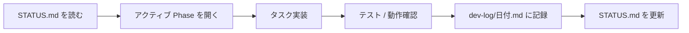

# プロジェクト計画 — 共演配信・Neuro 様方向

> **Claude Code / Cursor エージェント向け正本**  
> 実装前にこのファイルと [../dev-log/STATUS.md](../dev-log/STATUS.md) を読むこと。

## 目的

人間配信者と AI キャラクターを一緒に配信し、Neuro-sama のように「常に聞いていて・画面を見て・記憶して・感情豊かに動き・状況に応じて話しかける」体験へ段階的に近づける。

**参照**: [pngtuber-main](../../pngtuber-main)（別リポ）、実装 `src/features/`

---

## 自律開発ワークフロー（エージェント用）

各セッションで次の順に実施する。



### 1. 開始時（必須）

1. [../dev-log/STATUS.md](../dev-log/STATUS.md) — **現在の Phase・進行中タスク・ブロッカー**
2. [phases/README.md](phases/README.md) — マイルストーンと次のアクション
3. 作業対象の Phase ファイル（例: [phases/phase-00-foundation.md](phases/phase-00-foundation.md)）

### 2. 実装中

- タスク ID（例: `1-2`）をコミットメッセージ or dev-log に紐づける
- 計画にない大きな変更は、先に dev-log に「提案」として書き、ユーザー確認が望ましい
- 日本語の UI 文言は `locales/ja/` のみ更新（他言語は同期スキル任せ）

### 3. 終了時（必須）

1. **当日**の [../dev-log/YYYY-MM-DD.md](../dev-log/) に追記（なければ新規作成）
2. [../dev-log/STATUS.md](../dev-log/STATUS.md) を更新:
   - `アクティブ Phase`
   - 完了したタスク ID（チェック）
   - `次にやること`（1〜3 個、具体的に）
   - `ブロッカー`（あれば）

### 4. 計画書の更新タイミング

| 変更の種類                  | 更新先                                        |
| --------------------------- | --------------------------------------------- |
| タスク完了                  | dev-log + STATUS のみ                         |
| タスク追加・優先度変更      | 該当 `phases/phase-*.md` + dev-log            |
| 調査結果（実装済み/未実装） | [current-state.md](current-state.md) + matrix |
| 方針転換                    | [vision.md](vision.md) + dev-log              |

---

## ドキュメントマップ

| ファイル                                             | 内容                                                          |
| ---------------------------------------------------- | ------------------------------------------------------------- |
| [vision.md](vision.md)                               | ビジョン・Neuro 方向の軸                                      |
| [architecture.md](architecture.md)                   | 概念アーキテクチャ・設計原則                                  |
| [current-state.md](current-state.md)                 | 既存機能・pngtuber 参考・体傾け/背景調査                      |
| [matrix.md](matrix.md)                               | 機能マトリクス（計画 vs 現状）                                |
| [glossary.md](glossary.md)                           | 用語集                                                        |
| [risks.md](risks.md)                                 | リスクと対策                                                  |
| [out-of-scope.md](out-of-scope.md)                   | 当面やらないこと                                              |
| [reference/idle-mode.md](reference/idle-mode.md)     | アイドルモードの説明                                          |
| [co-streaming-preset.md](co-streaming-preset.md)     | 共演プリセット A/B/C の詳細・タグ構文リファレンス             |
| [obs-streaming-guide.md](obs-streaming-guide.md)     | OBS シーン構成・音声ルーティング・ブラウザソース設定          |
| [onecomme-guide.md](onecomme-guide.md)               | わんコメ連携設定・共演モード挙動・トラブルシューティング      |
| [e2e-youtube-checklist.md](e2e-youtube-checklist.md) | YouTube 共演配信 E2E チェックリスト                           |
| [irodori-tts-migration.md](irodori-tts-migration.md) | **Irodori-TTS 移行計画**（SBV2 からの将来移行・ローカルパス） |
| [phases/](phases/)                                   | Phase 0〜6 のタスク・完了条件                                 |

---

## Phase 依存関係（概要）

```
Phase 0（基盤）
  → Phase 1（STT）
  → Phase 2（画面実況） ─┐
  → Phase 3（記憶・任意）  ├→ Phase 4（能動発話）
                           └→ Phase 4.5（会話リアリティ）
                                 → Phase 5（共演）
                                 → Phase 6（身体性演出）
```

---

## 環境メモ

- Node.js **24.x**（`.nvmrc`）
- macOS + Homebrew `vips` がある場合: `export SHARP_IGNORE_GLOBAL_LIBVIPS=1`（`npm install` 時）
- 詳細手順は dev-log に随時追記

---

**最終更新**: 2026-05-23（ドキュメント階層化）
