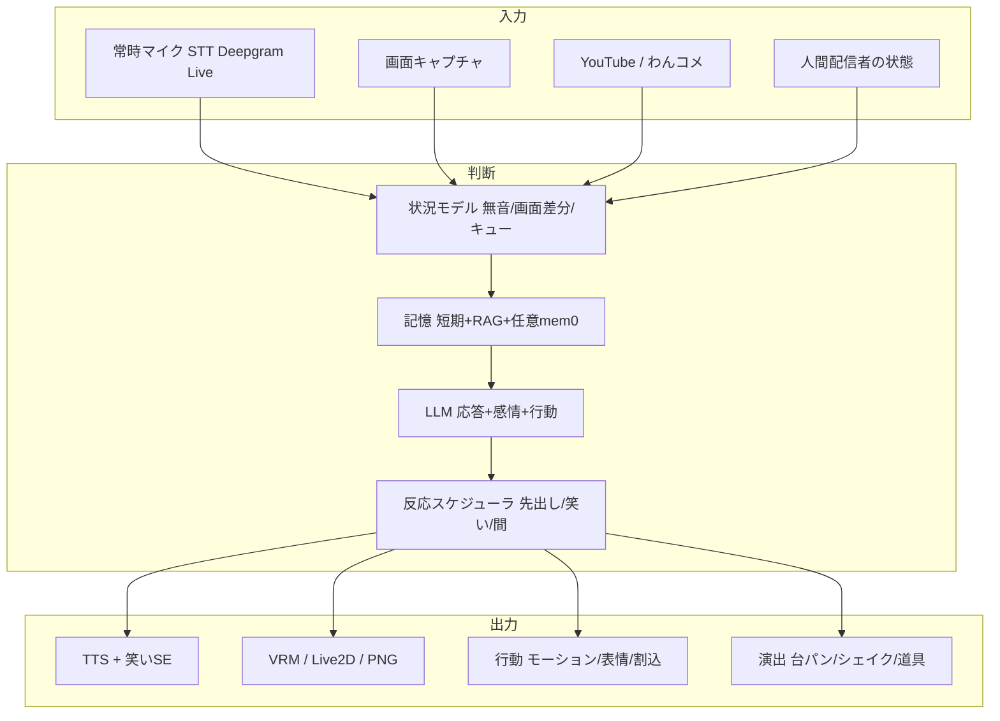

# 目標アーキテクチャ

**設計原則**

1. **単一の発話キュー**（`SpeakQueue` 拡張）— 人間の発話中は AI が被らない優先度制御
2. **状況はストア1箇所** — `homeStore` または新 `sessionStore` に集約
3. **ブラウザ完結を優先** — mem0/Qdrant はサーバー負荷・運用が重いため Phase 3 で要否判断

---
