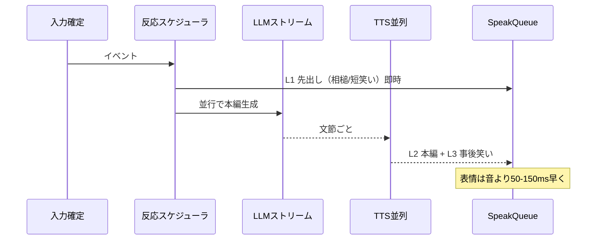

# Phase 4.5 — 会話リアリティ（笑い声・反応速度）

> 親: [フェーズ一覧](README.md) · [プロジェクト計画](../README.md)


**ゴール**: 会話が「読み上げ AI」ではなく、**笑ったり・すぐ反応したり・間を置いたり**する配信者に近づける。Neuro 様の印象のかなりの部分は **レイテンシと非言語音声** に依存する。

#### 4.5.1 現状のボトルネック（AITuberKit）

| 段階 | 現状 | 体感的な問題 |
|------|------|--------------|
| 入力確定 | コメント/STT 確定後に LLM 開始 | 聞いてから考えるまでが遅い |
| LLM | ストリームあり（`processAIResponse`） | 最初のトークンまで待ちがち |
| 発話分割 | **文が揃ってから** TTS（`extractSentence` → `handleSpeakAndStateUpdate`） | 長い返答ほど **初声が遅い** |
| 再生 | `SpeakQueue` が **1本ずつ直列**（`QUEUE_CHECK_DELAY` 等） | 笑いと本編がキューで遅延 |
| 笑い | テキストの「www」「（笑）」を TTS が読むだけ | **笑い声にならない** |
| 表情 | `[happy]` 等は本編と同タイミング | 笑い専用の短い表情先行がない |

#### 4.5.2 目標指標（設計時の目安）

配信共演を想定した **社内目標**（環境・モデルで変動するため測定必須）:

| 指標 | 説明 | 目標（初期） | 理想（Neuro 寄り） |
|------|------|-------------|-------------------|
| **TTFR** | Time To First Reaction（相槌・短い笑い等、最初の音） | &lt; 1.5s | &lt; 0.8s |
| **TTFA** | Time To First Answer（本題の最初の一語） | &lt; 3s | &lt; 2s |
| **文間ギャップ** | ストリーム中の文と文の無音 | &lt; 400ms | &lt; 200ms（パイプライン並列化） |
| **笑い品質** | 聴感で「笑っている」 | 専用 SE or 非言語 TTS | 文脈に合う長さ・強さのバリエーション |

測定方法: コメント投稿 or STT 確定タイムスタンプ → `SpeakQueue` 最初の `addTask` までをログ（`performance.mark` / サーバー側メトリクス）。

#### 4.5.3 レイヤー設計（反応の速さ）



| レイヤー | 内容 | 例 | 実装方針 |
|--------|------|-----|----------|
| **L0** | 聴いている見せ | 目線・小さなうなずき | Live2D/VRM の idle 揺れ（TTS 不要） |
| **L1** | **先出し反応** | 「えっ」「ふふ」「まじ？」「うわ」 | ルール or 軽量 LLM で **全文生成を待たない** |
| **L2** | 本編 | ツッコミ・回答 | 現行ストリーム TTS の改善 |
| **L3** | **事後非言語** | 笑い・息・間 | 専用 SE / 短 TTS クリップ |

**低遅延経路の優先順位（検討）**

1. **Realtime API モード** — 音声入出力一体（既存、配信共演時は人間マイクと役割分担要設計）
2. **LLM ストリーム + 文節パイプライン TTS** — 現行路線の並列化・先読み
3. **ハイブリッド** — L1 だけルールベース SE、L2 以降 LLM

#### 4.5.4 笑い声の再現（現実に近づける）

「テキストに（笑）を足す」だけでは不十分。**音声・表情・タイミング** をセットで設計する。

| 方式 | 説明 | メリット | デメリット |
|------|------|----------|------------|
| **A. 笑い SE ライブラリ** | `assets/reactions/laugh_short.wav` 等を `SpeakQueue` に挿入 | 聴感が最も自然、遅延小 | バリエーションは録音依存 |
| **B. TTS 非言語タグ** | エンジン依存（SSML・感情パラメータ） | 1パイプラインで済む | VOICEVOX/SBV2 等の対応調査が必要 |
| **C. 笑い専用 TTS クリップ** | 短い「あはは」を事前合成してキャッシュ | キャラ声が統一 | 初回生成コスト |
| **D. LLM 出力タグ** | `[laugh:short]` `[laugh:big]` `[breath]` | 文脈で長さ選択 | A〜C の下位レイヤが必要 |

**推奨**: まず **A + D**（確実に笑い声になる）→ 余力で B/C。

**プロンプト・パース拡張（案）**

```
出力例:
[laugh:short] ふふっ、[happy] それマジ？[motion:lean] うそでしょ！
```

- `handlers.ts` の `extractEmotion` / `extractMotionTag` と同様に **`extractReactionTag`** を追加
- 笑いタグは **本文 TTS の前** に SE をキュー投入（表情 `happy` + 体モーションを 50〜150ms 先行）

**TTS エンジン別メモ**

| エンジン | 笑い向き | 備考 |
|----------|----------|------|
| VOICEVOX / Aivis / SBV2 | △ | 記号・伸ばしで近似、専用 SE の方が自然なことが多い |
| ElevenLabs / OpenAI TTS | ○〜△ | プロソディ・タグ次第 |
| ローカル Irodori 系（pngtuber） | ○ | 絵文字感情 — 本 Kit には未統合 → [irodori-tts-migration.md](../irodori-tts-migration.md) |

#### 4.5.5 タスク一覧

| # | タスク | 詳細 | 優先度 |
|---|--------|------|--------|
| 4.5-1 | レイテンシ計測 | TTFR/TTFA をログ出力、ダッシュボード or 開発者コンソール | P0 |
| 4.5-2 | 反応スケジューラ | `src/features/conversation/reactionScheduler.ts`（新規）— L1/L3 のキュー挿入 | P0 |
| 4.5-3 | 笑い SE + タグ | `assets/reactions/`、`[laugh:*]` パース、`SpeakQueue` 優先度 | P0 |
| 4.5-4 | TTS パイプライン並列 | 文 N の TTS 生成と文 N-1 の再生をオーバーラップ | P1 |
| 4.5-5 | 先出し反応ルール | コメントキーワード / 感情強度で L1 テンプレ選択（LLM 待ちしない） | P1 |
| 4.5-6 | 表情先行 | 音再生 50〜150ms 前に Live2D Expression / VRM 表情 | P1 |
| 4.5-7 | 軽量相槌 LLM（任意） | 全文生成と並列で 5 トークン以内の反応のみ | P2 |
| 4.5-8 | Realtime 経路の共演設計 | 人間マイクと AI 音声のミキシング・割込みポリシー | P2 |
| 4.5-9 | プロンプトガイド | キャラが「笑うタイミング」を学習する system 追記（過剰笑い抑制含む） | P1 |

**完了条件（M4.5）**

- 面白いコメントに対し、**1.5 秒以内**に短い笑い or 相槌が聞こえる  
- 続けて **本題のツッコミ** が自然な間で続く（「ワンセット」に聞こえる）  
- 聴感テスト 5 場面中 3 場面以上で「笑っている」と評価（主観チェックリスト）

---
